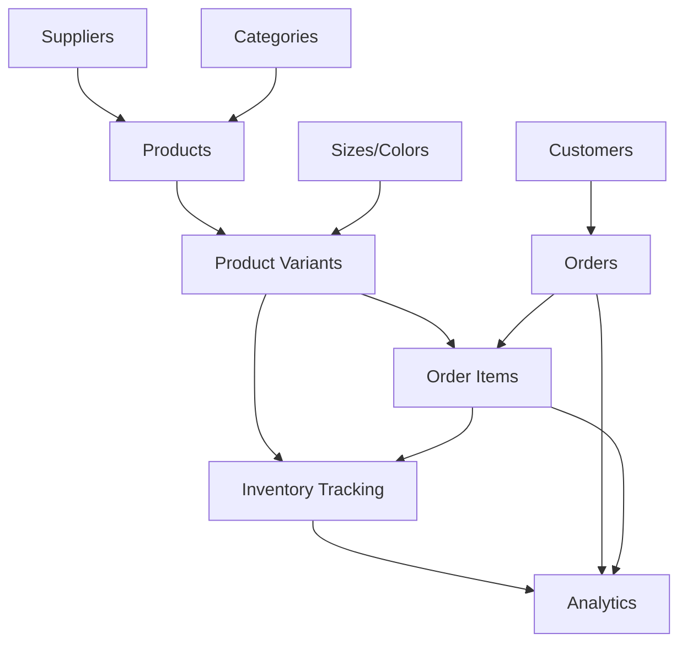

# Spectre Clothing System Process Mapping

## Overview
This document provides a comprehensive process mapping of the Spectre Clothing inventory and order management system, showing inputs, outputs, activities, and decision points for all core business processes.

---

## 1. **Product Management Process**

### Process Flow
```
[Supplier Information] → [Product Creation] → [Category Assignment] → [Image Upload] → [Product Catalog]
```

### Detailed Process Map

#### **Input Sources:**
- Supplier information
- Product specifications (name, SKU, prices)
- Product category
- Product images
- Product descriptions

#### **Process Steps:**
1. **Product Registration**
   - Input: Basic product information
   - Activity: Create product record
   - Validation: SKU uniqueness check
   - Output: Product ID generated

2. **Category Assignment**
   - Input: Category selection
   - Activity: Link product to category
   - Decision: Category exists? (Yes → Link, No → Create new)
   - Output: Categorized product

3. **Supplier Association**
   - Input: Supplier selection (optional)
   - Activity: Link product to supplier
   - Decision: Supplier exists? (Yes → Link, No → Continue without)
   - Output: Product with supplier relationship

4. **Image Management**
   - Input: Product images
   - Activity: Upload and process images
   - Decision: Primary image selection
   - Output: Product with visual assets

#### **Decision Points:**
- ✓ Is SKU unique?
- ✓ Does category exist?
- ✓ Is supplier selected?
- ✓ Are images provided?

#### **Outputs:**
- Product record in database
- Product available in catalog
- Product listed for variant creation

---

## 2. **Inventory Management Process**

### Process Flow
```
[Product] → [Variant Creation] → [Stock Assignment] → [Inventory Tracking] → [Stock Alerts]
```

### Detailed Process Map

#### **Input Sources:**
- Existing products
- Size and color options
- Initial stock quantities
- Reorder levels

#### **Process Steps:**
1. **Variant Creation**
   - Input: Product + Size + Color combination
   - Activity: Create unique variant
   - Validation: Combination uniqueness check
   - Output: Product variant record

2. **Stock Assignment**
   - Input: Initial quantity and reorder level
   - Activity: Set stock levels
   - Decision: Quantity > 0? (Yes → Create adjustment record)
   - Output: Stocked variant

3. **Inventory Tracking**
   - Input: Stock movements (incoming/outgoing/adjustments)
   - Activity: Update quantity levels
   - Decision: Quantity below reorder level? (Yes → Flag as low stock)
   - Output: Updated inventory levels

4. **Stock Monitoring**
   - Input: Current stock levels
   - Activity: Compare with reorder levels
   - Decision: Stock status assessment
   - Output: Stock alerts and reports

#### **Decision Points:**
- ✓ Is variant combination unique?
- ✓ Is initial quantity > 0?
- ✓ Is current stock below reorder level?
- ✓ Is stock completely depleted?

#### **Inventory Adjustment Sub-Process:**
```
[Adjustment Request] → [Type Selection] → [Quantity Validation] → [Stock Update] → [Audit Record]
```

#### **Outputs:**
- Product variants with stock levels
- Inventory adjustment records
- Low stock alerts
- Out of stock notifications

---

## 3. **Order Management Process**

### Process Flow
```
[Customer Info] → [Product Selection] → [Stock Validation] → [Order Creation] → [Fulfillment] → [Completion]
```

### Detailed Process Map

#### **Input Sources:**
- Customer information
- Product variant selections
- Quantities requested
- Order notes

#### **Process Steps:**
1. **Customer Management**
   - Input: Customer details (name, email, phone, address)
   - Activity: Create or select existing customer
   - Decision: Customer exists? (Yes → Select, No → Create new)
   - Output: Customer record

2. **Product Selection**
   - Input: Product variants and quantities
   - Activity: Build order items list
   - Validation: Quantity > 0 for each item
   - Output: Order items collection

3. **Stock Validation**
   - Input: Requested quantities
   - Activity: Check available stock for each variant
   - Decision: Sufficient stock? (Yes → Continue, No → Show error)
   - Output: Validated order items

4. **Order Creation**
   - Input: Customer + Validated items
   - Activity: Create order record with items
   - Transaction: Atomically create order and items
   - Output: Order with unique ID

5. **Order Processing**
   - Input: Created order
   - Activity: Status management (Pending → Processing → Shipped → Delivered)
   - Decision: Status update triggers
   - Output: Updated order status

6. **Stock Adjustment**
   - Input: Confirmed order
   - Activity: Reduce variant quantities
   - Decision: Auto-adjust stock? (Yes → Create outgoing adjustments)
   - Output: Updated inventory levels

#### **Decision Points:**
- ✓ Does customer exist?
- ✓ Are quantities valid (> 0)?
- ✓ Is sufficient stock available?
- ✓ Should stock be auto-adjusted?
- ✓ Is order status change valid?

#### **Order Status Workflow:**
```
PENDING → PROCESSING → AWAITING_PAYMENT → SHIPPED → DELIVERED
                                                ↓
                                          CANCELLED (any stage)
```

#### **Outputs:**
- Order records
- Order items
- Customer order history
- Inventory adjustments
- Order status updates

---

## 4. **Supplier Management Process**

### Process Flow
```
[Supplier Registration] → [Product Association] → [Supplier Catalog] → [Supplier Reporting]
```

### Detailed Process Map

#### **Input Sources:**
- Supplier company information
- Contact details
- Product associations

#### **Process Steps:**
1. **Supplier Registration**
   - Input: Supplier details (name, contact person, email, phone, address)
   - Activity: Create supplier record
   - Validation: Required fields check
   - Output: Supplier profile

2. **Product Association**
   - Input: Product selections
   - Activity: Link products to supplier
   - Decision: Products available? (Yes → Link, No → Continue)
   - Output: Supplier-product relationships

3. **Supplier Catalog Management**
   - Input: Supplier modifications
   - Activity: Update supplier information
   - Decision: Has associated products? (Yes → Show products)
   - Output: Updated supplier catalog

#### **Decision Points:**
- ✓ Are required fields provided?
- ✓ Are products available for association?
- ✓ Should supplier be deleted? (Check product dependencies)

#### **Outputs:**
- Supplier directory
- Product-supplier mappings
- Supplier contact information

---

## 5. **Analytics & Reporting Process**

### Process Flow
```
[Order Data] → [Sales Analysis] → [Performance Metrics] → [Visual Reports] → [Business Insights]
```

### Detailed Process Map

#### **Input Sources:**
- Order history
- Product sales data
- Time period selections
- Category information

#### **Process Steps:**
1. **Data Collection**
   - Input: Historical orders and items
   - Activity: Aggregate sales data by period
   - Processing: Calculate metrics (revenue, quantities, averages)
   - Output: Processed sales data

2. **Performance Analysis**
   - Input: Current and previous period data
   - Activity: Calculate growth rates and trends
   - Decision: Compare periods for insights
   - Output: Performance metrics

3. **Category Analysis**
   - Input: Product category sales
   - Activity: Group and analyze by category
   - Processing: Calculate percentages and rankings
   - Output: Category performance data

4. **Product Analysis**
   - Input: Individual product sales
   - Activity: Rank products by performance
   - Decision: Identify top performers
   - Output: Product rankings

5. **Visualization Generation**
   - Input: Processed analytics data
   - Activity: Generate charts and tables
   - Processing: Format for display
   - Output: Visual reports and dashboards

#### **Key Metrics Calculated:**
- **Sales Metrics:**
  - Total Sales Revenue
  - Total Orders Count
  - Average Order Value (AOV)
  - Growth rates (period-over-period)

- **Product Metrics:**
  - Top selling products
  - Category performance
  - Units sold by product
  - Revenue by category

- **Trend Analysis:**
  - Daily sales trends
  - Seasonal patterns
  - Growth trajectories

#### **Decision Points:**
- ✓ Which time period to analyze?
- ✓ Are there sufficient data points?
- ✓ Which categories to highlight?
- ✓ How to visualize trends?

#### **Outputs:**
- Sales dashboards
- Performance reports
- Category analysis charts
- Product ranking tables
- Trend visualizations

---

## 6. **Dashboard Overview Process**

### Process Flow
```
[System Data] → [KPI Calculation] → [Alert Generation] → [Dashboard Display] → [User Actions]
```

### Detailed Process Map

#### **Input Sources:**
- Today's orders
- Current inventory levels
- Recent activities
- System statistics

#### **Process Steps:**
1. **Real-time Data Collection**
   - Input: Current system state
   - Activity: Query recent data (today's orders, inventory status)
   - Processing: Aggregate key metrics
   - Output: Current KPIs

2. **Alert Generation**
   - Input: Inventory levels and business rules
   - Activity: Identify exceptions (low stock, pending orders)
   - Decision: Alert thresholds exceeded?
   - Output: System alerts and warnings

3. **Summary Preparation**
   - Input: Recent activities and transactions
   - Activity: Prepare activity summaries
   - Processing: Format for display
   - Output: Activity feeds

4. **Dashboard Assembly**
   - Input: KPIs, alerts, and summaries
   - Activity: Compose dashboard layout
   - Processing: Real-time display preparation
   - Output: Interactive dashboard

#### **Key Performance Indicators (KPIs):**
- Today's sales revenue
- Number of orders processed
- Pending orders count
- Low stock items count
- Total products in catalog

#### **Decision Points:**
- ✓ Are there low stock alerts?
- ✓ Are there pending orders?
- ✓ Should recent activities be highlighted?
- ✓ Which metrics need attention?

#### **Outputs:**
- Executive dashboard
- Key performance indicators
- System alerts
- Quick action links
- Activity summaries

---

## 7. **User Access & Security Process**

### Process Flow
```
[User Authentication] → [Permission Check] → [Role-based Access] → [Activity Logging] → [Session Management]
```

### Detailed Process Map

#### **Input Sources:**
- User credentials
- Role assignments
- Permission matrices
- Session data

#### **Process Steps:**
1. **Authentication**
   - Input: Username and password
   - Activity: Validate credentials
   - Decision: Valid credentials? (Yes → Grant access, No → Deny)
   - Output: Authenticated session

2. **Authorization**
   - Input: User role and requested action
   - Activity: Check permissions matrix
   - Decision: Action permitted? (Yes → Allow, No → Redirect)
   - Output: Authorized access to features

3. **Role-based Feature Access**
   - Input: User role (Admin, Stock Manager, Sales Staff)
   - Activity: Enable/disable features based on role
   - Processing: Customize interface
   - Output: Role-appropriate interface

#### **Permission Matrix:**
| Feature | Admin | Stock Manager | Sales Staff |
|---------|-------|---------------|-------------|
| Product Management | ✓ | ✓ | View Only |
| Inventory Management | ✓ | ✓ | Limited |
| Order Management | ✓ | ✓ | ✓ |
| Supplier Management | ✓ | Limited | - |
| User Management | ✓ | - | - |
| Analytics & Reports | ✓ | ✓ | Limited |

#### **Decision Points:**
- ✓ Are credentials valid?
- ✓ Does user have required permissions?
- ✓ Is session active?
- ✓ Should access be logged?

#### **Outputs:**
- Authenticated user sessions
- Role-based feature access
- Security audit logs
- Session management

---

## Integration Points & Data Flow

### Cross-Process Data Dependencies



### Key Integration Workflows

1. **Product-to-Sale Flow:**
   - Product Creation → Variant Creation → Stock Assignment → Order Processing → Sales Analytics

2. **Inventory Update Flow:**
   - Stock Adjustment → Inventory Update → Alert Generation → Dashboard Notification

3. **Order-to-Inventory Flow:**
   - Order Creation → Stock Validation → Order Processing → Inventory Deduction → Analytics Update

4. **Reporting Flow:**
   - Transaction Data → Analytics Processing → Report Generation → Dashboard Display

---

## Process Optimization Recommendations

### Current Process Strengths
- Clear data relationships and constraints
- Comprehensive audit trails
- Role-based access control
- Real-time inventory tracking
- Integrated analytics

### Areas for Enhancement
- **Automated Reordering:** Trigger purchase orders when stock hits reorder levels
- **Batch Processing:** Handle bulk inventory adjustments
- **Advanced Analytics:** Predictive analytics for demand forecasting
- **Workflow Automation:** Automated status updates based on business rules
- **Integration APIs:** External system integrations (accounting, shipping)

### Process Metrics to Monitor
- Order processing time
- Inventory accuracy rates
- Stock turnover ratios
- Customer satisfaction scores
- System response times

---

This process mapping provides a comprehensive view of how data flows through the Spectre Clothing system and where business decisions are made throughout each workflow.
